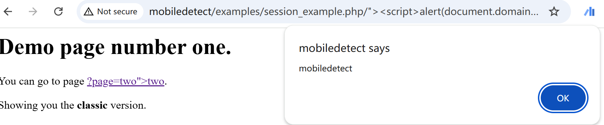

# Vulnerability Type

Cross-site Scripting

# Description

A vulnerability, which was classified as problematic, has been found in MobileDetect 2.8.31. This issue affects the function initLayoutType of the file examples/session_example.php of the component Example. The manipulation of the argument $_SERVER['PHP_SELF'] leads to cross site scripting. The attack may be initiated remotely. The exploit has been disclosed to the public and may be used. Upgrading to version 2.8.32 is able to address this issue. The identifier of the patch is 31818a441b095bdc4838602dbb17b8377d1e5cce. It is recommended to upgrade the affected component. The identifier VDB-220061 was assigned to this vulnerability.

# PoC Report

 ## Environment Setup

 - Software Link: https://github.com/serbanghita/Mobile-Detect/
 - Version: 4da80e5
 - Tested on: Windows 10

 ## Exploit Description

There is a XSS in MobileDetect due to a complete lack of input sanitization or filtering.

 ## Steps to Reproduce

 1. Login as an admin user.
 1. Send the request.
 1. Observe the result: 



 ## Proof Of Concept
```
GET http://mobiledetect/examples/session_example.php/%22%3E%3Cscript%3Ealert(document.domain)%3C/script%3E
```

