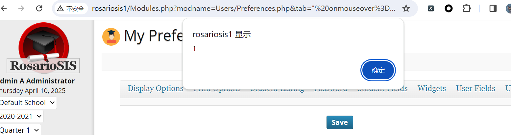

# Vulnerability Type

Cross-site Scripting

# Description

RosarioSIS 6.7.2 is vulnerable to XSS, caused by improper validation of user-supplied input by the Preferences.php script. A remote attacker could exploit this vulnerability using the tab parameter in a crafted URL.

# PoC Report

 ## Environment Setup

 - Software Link: https://gitlab.com/francoisjacquet/rosariosis
 - Version: 6.7.2
 - Tested on: Windows 10

 ## Exploit Description

The vulnerable variable `tab` must bypass the `strip_tags` sanitization and meet syntax constraints at the sink. The data flow is only reachable when `modname`  path constraints are satisfied.

 ## Steps to Reproduce

  1. Log in as an admin user.
  2. Send the request.
  3. Observe the result: 



 ## Proof Of Concept

```
http://rosariosis/Modules.php?modname=Users/Preferences.php&tab=%22%20onmouseover%3Dalert%281%29%20x%3D%22

**Conditions**:  
1. User must be authenticated (as shown by the session checks in `Warehous.php`)
2. `modfunc` parameter must **not** be present in the request
```

