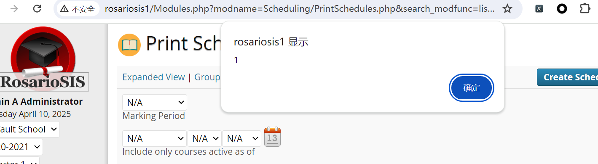

# Vulnerability Type

Cross-site Scripting

# Description

RosarioSIS 6.7.2 is vulnerable to XSS, caused by improper validation of user-supplied input by the PrintSchedules.php script. A remote attacker could exploit this vulnerability using the include_inactive parameter in a crafted URL.

# PoC Report

 ## Environment Setup

 - Software Link: https://gitlab.com/francoisjacquet/rosariosis
 - Version: 6.7.2
 - Tested on: Windows 10

 ## Exploit Description

The vulnerable variable `include_inactive` must bypass the `strip_tags` sanitization and meet syntax constraints at the sink. The application execution flow is only reachable when `modname` and `search_modfunc` path constraints are satisfied.

 ## Steps to Reproduce

  1. Log in as an admin user.
  2. Send the request.
  3. Observe the result: 



 ## Proof Of Concept
```
http://rosariosis/Modules.php?modname=Scheduling/PrintSchedules.php&search_modfunc=list&include_inactive=" onmouseover="alert(1)"
```

