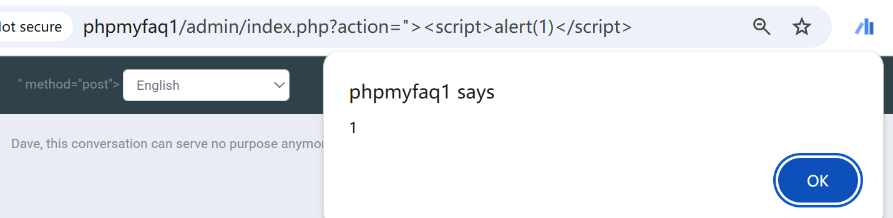

# Vulnerability Type

Cross-site Scripting

# Description

Cross-site Scripting (XSS) - Reflected in GitHub repository thorsten/phpmyfaq prior to 3.1.9.

# PoC Report

 ## Environment Setup

 - Software Link: https://github.com/thorsten/phpmyfaq/
 - Version: 3.1.7
 - Tested on: Windows 10

 ## Exploit Description

The source is located in `admin/index.php`, and the sink is in `admin/header.php`. The vulnerable parameter is `action`, which must meet specific syntax constraints to trigger the vulnerability.

 ## Steps to Reproduce

 1. Log in as an admin user.
 1. Send the request.
 1. Observe the result: 



 ## Proof Of Concept
```
GET http://phpmyfaq1/admin/index.php?action=%22%3E%3Cscript%3Ealert(1)%3C/script%3E 
```

