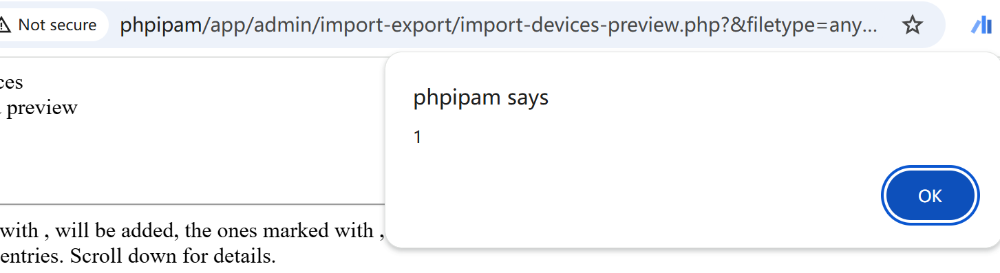

# Vulnerability Type

Cross-site Scripting

# Description

phpipam 1.6 is vulnerable to Cross Site Scripting (XSS) via app\admin\import-export\import-load-data.php.

# PoC Report

 ## Environment Setup

 - Software Link: https://github.com/phpipam/phpipam/
 - Version: 1.5.1
 - Tested on: Windows 10

 ## Exploit Description

The sink is located in `app/admin/import-export/import-devices-preview.php`, and the source of the tainted input is in `app/admin/import-export/import-load-data.php`. These two files are linked through a PHP `include`. XSS in phpipam occurs when `filetype`, `expfields`, and `importFields__<expfield>` parameters are properly set.

 ## Steps to Reproduce

 1. Login as an admin user.
 1. Send the request.
 1. Observe the result: 



 ## Proof Of Concept
```
GET http://phpipam/app/admin/import-export/import-devices-preview.php?&filetype=anyValidFiletype&expfields=%22%3E%3Cscript%3Ealert%281%29%3C/script%3E&importFields__%22%3E%3Cscript%3Ealert%281%29%3C/script%3E=anyValue
```

